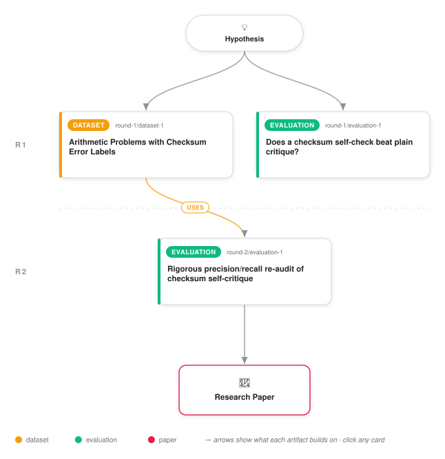

# Checksum Self-Critique Helps Weak Arithmetic, Hurts Weak Models

<div align="center">

<a href="https://cdn.jsdelivr.net/gh/AMGrobelnik/ai-invention-74dec2-checksum-self-critique-helps-weak-arithm@main/workflow.svg">
<picture>
  <source media="(prefers-color-scheme: dark)" srcset="workflow-dark.svg">
  
</picture>
</a>

<sub>🖱️ <b><a href="https://cdn.jsdelivr.net/gh/AMGrobelnik/ai-invention-74dec2-checksum-self-critique-helps-weak-arithm@main/workflow.svg">Open the interactive diagram</a></b> — every card links to its artifact folder.</sub>

</div>

> **TL;DR** — This revision resolves all three major reviewer critiques: it adds the previously-pending third model (llama-3.1-8b-instruct), revealing that checksum self-critique is not a diminishing-benefit-with-capability effect but a non-monotonic one -- large gain for a strong model, null for a mid-capability model, and a catastrophic 67-point collapse for a weak model driven by hallucinated computation steps under bookkeeping load; it delivers a properly powered, Wilson-CI-backed detection precision/recall/F1 re-audit across all three models and four conditions that was previously underpowered; and it replaces the previous same-model LLM-judge checksum-reliability audit with a deterministic, zero-LLM-call mod-9 checker, showing via a negative Cohen's kappa (-0.12) that the same-model judge's verdicts did not track ground-truth arithmetic correctness, and revising the self-computation error rate down from 15.4% to 9.6%. Minor critiques are also addressed: exact non-duplicated p-values and test statistics are reported for every comparison, verbatim prompt text for every condition is included in a new appendix, the orphan Stechly et al. citation is now cited in Related Work, and the GSM8K-vs-synthetic baseline breakdown and the associated 195/200 sample-size question are explicitly reported as data-availability limitations rather than silently dropped.

<details>
<summary>Full hypothesis</summary>

When an LLM verifies its own multi-step arithmetic word-problem solution using an explicit, mechanically-computed modular-arithmetic invariant (a 'casting-out-nines' digit-root checksum applied to each intermediate computation) instead of an open-ended 'double-check your work' self-critique prompt or a length-matched content-null placebo critique, the effect on error-detection and downstream correction accuracy is not a uniform benefit and is not simply monotonically diminishing with baseline capability -- it is capability-gated in a way that can invert sign entirely. On claude-haiku-4.5 (76.5% no-critique baseline, n=200), checksum critique raised accuracy to 97.5%, beating free-form critique by 17.0pp (McNemar p=1.08e-9) and the matched-length placebo by 6.5pp overall / 9.375pp on the checksum-detectable subset (bootstrap CI excludes zero), with the placebo response length if anything slightly exceeding the checksum condition's -- evidence the gain is attributable to the invariant's content, not extra deliberation tokens. On openai/gpt-4o-mini (95.5% baseline, near ceiling), all four conditions are statistically indistinguishable (largest gap 2.0pp, p=0.481), a flat null rather than a smaller positive effect. On meta-llama/llama-3.1-8b-instruct (84.5% baseline -- comparable headroom to claude-haiku-4.5's, which rules out 'headroom alone' as the operative variable), checksum critique collapses accuracy to 17.1% (McNemar p=1.2e-31 vs free-form), a catastrophic degradation traced qualitatively to the model fabricating extra computation steps absent from the original problem while performing the interleaved digit-root bookkeeping, evidenced by an 8x baseline response-length blowup and a strongly negative length-vs-accuracy-gain correlation (-0.40) unique to this model. This three-point pattern is treated as a pilot observation motivating, not establishing, a general capability-threshold or U-shaped functional form, and -- per reviewer critique -- the three models differ in vendor and instruction-tuning regime as well as capability, so the 'capability-conditioned' framing is explicitly a hypothesis to be tested with a same-family capability sweep, not a confirmed causal claim; llama-3.1-8b-instruct's collapse may partly reflect vendor-specific brittleness under long compound instructions rather than pure capability. The self-computed-checksum reliability bottleneck claim is revised: a deterministic, zero-LLM-call regex-based mod-9 checker (replacing the prior same-model LLM-judge design, which a follow-up Cohen's kappa of -0.12 against the same 70-trace sample shows performs at worse-than-chance agreement with ground truth) finds a 9.6% checksum-computation error rate overall, ordered by model capability (4.5% claude-haiku-4.5, 12.4% llama-3.1-8b-instruct, 14.6% gpt-4o-mini) -- notably not perfectly capability-ordered, since gpt-4o-mini has the highest checksum-computation error rate despite the highest task accuracy, indicating checksum-sub-task reliability and end-task accuracy are dissociable quantities. A major methodological gap remains unresolved across two review rounds: detection precision/recall has still only been measured via the proxy 'model's own baseline solve on the ORIGINAL uncorrelated problem differs from gold', not by running the four critique conditions directly on the already-built, verified 1,535-row error-injection dataset (art_UafZp2AqR5at) where ground truth is a known injected error the model is shown -- this remains the single highest-priority open test of the paper's central mechanistic claim (does the model actually catch an error it was shown corrupted, not merely disagree with itself) and is treated as unsupported until run.

</details>

[](https://cdn.jsdelivr.net/gh/AMGrobelnik/ai-invention-74dec2-checksum-self-critique-helps-weak-arithm@main/paper.pdf) [](https://github.com/AMGrobelnik/ai-invention-74dec2-checksum-self-critique-helps-weak-arithm/tree/main/paper_latex)

This repository contains all **3 artifacts** produced across **2 rounds** of an autonomous AI research run — round by round, exactly in the order they were invented.

## Round 1

| Artifact | Type | Demo | Source | Builds on |
|----------|------|------|--------|-----------|
| **[Arithmetic Problems with Checksum Error Labels](https://github.com/AMGrobelnik/ai-invention-74dec2-checksum-self-critique-helps-weak-arithm/tree/main/round-1/dataset-1)** | [](https://github.com/AMGrobelnik/ai-invention-74dec2-checksum-self-critique-helps-weak-arithm/tree/main/round-1/dataset-1) | [](https://colab.research.google.com/github/AMGrobelnik/ai-invention-74dec2-checksum-self-critique-helps-weak-arithm/blob/main/round-1/dataset-1/demo/data_code_demo.ipynb) | [](https://github.com/AMGrobelnik/ai-invention-74dec2-checksum-self-critique-helps-weak-arithm/tree/main/round-1/dataset-1/src) | — |
| **[Does a checksum self-check beat plain critique?](https://github.com/AMGrobelnik/ai-invention-74dec2-checksum-self-critique-helps-weak-arithm/tree/main/round-1/evaluation-1)** | [](https://github.com/AMGrobelnik/ai-invention-74dec2-checksum-self-critique-helps-weak-arithm/tree/main/round-1/evaluation-1) | [](https://colab.research.google.com/github/AMGrobelnik/ai-invention-74dec2-checksum-self-critique-helps-weak-arithm/blob/main/round-1/evaluation-1/demo/eval_code_demo.ipynb) | [](https://github.com/AMGrobelnik/ai-invention-74dec2-checksum-self-critique-helps-weak-arithm/tree/main/round-1/evaluation-1/src) | — |

## Round 2

| Artifact | Type | Demo | Source | Builds on |
|----------|------|------|--------|-----------|
| **[Rigorous precision/recall re-audit of checksum self-critique](https://github.com/AMGrobelnik/ai-invention-74dec2-checksum-self-critique-helps-weak-arithm/tree/main/round-2/evaluation-1)** | [](https://github.com/AMGrobelnik/ai-invention-74dec2-checksum-self-critique-helps-weak-arithm/tree/main/round-2/evaluation-1) | [](https://colab.research.google.com/github/AMGrobelnik/ai-invention-74dec2-checksum-self-critique-helps-weak-arithm/blob/main/round-2/evaluation-1/demo/eval_code_demo.ipynb) | [](https://github.com/AMGrobelnik/ai-invention-74dec2-checksum-self-critique-helps-weak-arithm/tree/main/round-2/evaluation-1/src) | <sub><i>uses:</i><br/>[dataset‑1&nbsp;(R1)](https://github.com/AMGrobelnik/ai-invention-74dec2-checksum-self-critique-helps-weak-arithm/tree/main/round-1/dataset-1)</sub> |

## Repository Structure

Artifacts are grouped by the round of invention that produced them. Each
artifact has its own folder with source code and a self-contained demo:

```
.
├── round-1/                         # One folder per round of invention
│   ├── experiment-1/
│   │   ├── README.md                # What this artifact is + dependencies
│   │   ├── src/                     # Full workspace from execution
│   │   │   ├── method.py            # Main implementation
│   │   │   ├── method_out.json      # Full output data
│   │   │   └── ...                  # All execution artifacts
│   │   └── demo/                    # Self-contained demo
│   │       └── method_code_demo.ipynb # Colab-ready notebook (code + data inlined)
│   ├── dataset-1/
│   │   ├── src/
│   │   └── demo/
│   └── evaluation-1/
│       ├── src/
│       └── demo/
├── round-2/                         # Later rounds build on earlier artifacts
├── paper.pdf                        # Research paper
├── paper_latex/                     # LaTeX source files
├── workflow.svg                     # Artifact dependency diagram (this page's header)
└── README.md
```

## Running Notebooks

### Option 1: Google Colab (Recommended)

Click the "Open in Colab" badges above to run notebooks directly in your browser.
No installation required!

### Option 2: Local Jupyter

```bash
# Clone the repo
git clone https://github.com/AMGrobelnik/ai-invention-74dec2-checksum-self-critique-helps-weak-arithm
cd ai-invention-74dec2-checksum-self-critique-helps-weak-arithm

# Install dependencies
pip install jupyter

# Run any artifact's demo notebook
jupyter notebook <artifact_folder>/demo/
```

## Source Code

The original source files are in each artifact's `src/` folder.
These files may have external dependencies - use the demo notebooks for a self-contained experience.

---
*Generated by AI Inventor Pipeline - Automated Research Generation*
